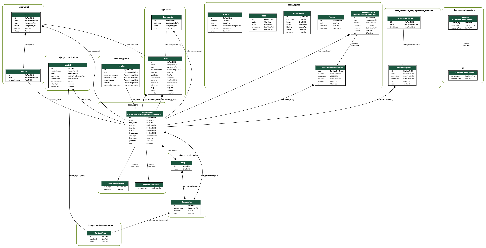

# Crypto Exchange Django Backend
### Backend structure:


## This project is a backend built with Django for a web platform where users can register, log in, create posts, obtain a Bitcoin wallet to deposit into, receive purchase offers from other users, accept offers by receiving a screenshot of the bank transfer, and withdraw Bitcoin from the wallet that a user has purchased. This backend uses the [python-bitcoin-utils](https://github.com/karask/python-bitcoin-utils) library to create transactions and the [python-hdwallet](https://github.com/meherett/python-hdwallet) library to create Bitcoin wallets.

## Frontend code https://github.com/Alberto200420/cryptoexchangeP2P-frontend

### The code emphasizes functions derived from bitcoin-utils and hdwallet.
## Features

### 1 - User authentication with JWT
The server allowed obtaining the name, surname, email and password to obtain that data and send an account activation code to the email provided by the user. When activating their account, the server changed the user's status from inactive to active.

### 2 - Automated email sending
The [sendgrid](https://sendgrid.com/en-us) server could send authentication codes to the email of the user who registered and email notifications to users about the status of exchange operations with other users (Bitcoin received, Post created, Offer taken, Offer accepted, Report of users making malignant operations).

### 3 - Creation of exchange operations
The server obtains the user's data (account number, bank name and referral (optional)) and returns the address to which the user should send the Bitcoins for their post to be activated.

### 3 - Creation of Bitcoin Address P2WPKH with [hdwallet](https://github.com/meherett/python-hdwallet) Library
```python
class CreateSalePostView(APIView):
    """
    First, it gets the parameters given in the request -> bankEntity, reference, (accountNumber <- (optional))
    then it calls:
    ```
    create_sale_and_address()
    ```
    
    afterwards, it serializes them, once serialized it saves them in the database and gets the slug
    ```
    def create_sale_and_address(self, serializer, request):
        sale = serializer.save(user=request.user)
        slug = sale.slug
        address = self.generate_btc_address(slug) # Generate a Bitcoin address based on a derivation path
    ```
    Generate a Bitcoin address based on a derivation path

    1 - Retrieve the MNEMONIC and PASSPHRASE from the environment variables
    2 - Extract the digits from the given path and use them to construct a derivation_path

    3 - Use BIP141HDWallet to generate a Bitcoin address from the mnemonic and the derivation path

    4 - Return the generated address

    After obtaining the address in a variable
    ```
    address = self.generate_btc_address(slug)
    ```
    Generate a Bitcoin address based on the sale slug.
    Assign the generated address to the sale and save the changes.
    Update the user's profile by incrementing the number of posts created (postsCreated).
    Return the generated address.

    If successful, return a response with the generated address and an HTTP 201 status.
    If an exception occurs: Return a response with the error and an HTTP 500 status.
    If the data is not valid: Return the serializer errors and an HTTP 400 status.

    """

    permission_classes = (permissions.IsAuthenticated, )

    def generate_btc_address(self, path):
        MNEMONIC = os.getenv('MNEMONIC')
        PASSPHRASE = os.getenv('PASSWORD')
        digits = [char for char in str(path) if char.isdigit()]
        digits_str = ''.join(digits)
        derivation_path = f"m/{digits_str[0:2]}/{digits_str[2:4]}/{digits_str[4:6]}'/{digits_str[6:9]}'/{digits_str[9:12]}'/{digits_str[12:14]}/{digits_str[14:16]}"
        hdwallet = BIP141HDWallet(symbol=SYMBOL, path=derivation_path)
        hdwallet.from_mnemonic(mnemonic=MNEMONIC, language='english', passphrase=PASSPHRASE)
        return hdwallet.address()

    def create_sale_and_address(self, serializer, request):
        sale = serializer.save(user=request.user)
        slug = sale.slug
        address = self.generate_btc_address(slug)
        sale.address = address
        sale.save()
        profile = get_object_or_404(Profile, user=request.user)
        profile.postsCreated += 1
        profile.save()
        return address

    def post(self, request, format=None):
        serializer = SaleCreateSerializer(data=request.data)
        if serializer.is_valid():
            try:
                address = self.create_sale_and_address(serializer, request)
                return Response({'address': address}, status=status.HTTP_201_CREATED)
            except Exception as e:
                return Response({'error': str(e)}, status=status.HTTP_500_INTERNAL_SERVER_ERROR)
        return Response(serializer.errors, status=status.HTTP_400_BAD_REQUEST)
```

### 4 - Withdraw bitcoin using [bitcoin-utils](https://github.com/karask/python-bitcoin-utils) library

```python
class Withdraw(APIView):
  permission_classes = (permissions.IsAuthenticated, )

  def checkTxPrevInputType(self, tx: str, address: str) -> bool:
    """
    Check if the received transaction (tx) was made with SegWit.
    
    Parameters:
    tx (str): Transaction ID.
    address (str): Bitcoin address to check against.

    Returns:
    bool: True if the transaction is SegWit, otherwise False.
    """
    try:
      txData = requests.get(url=f'https://mempool.space/api/tx/{tx}')
      dato = txData.json()
      # Iterate through the list of outputs to find the specified address
      for output in dato['vout']:
        if output['scriptpubkey_address'] == address:
          typeOf = output['scriptpubkey_type']
          if typeOf == 'v0_p2wpkh':
            return True
      # If the address is not found in the outputs, return False
      return False
    except Exception as e:
      logger.error(f"Error occurred checkTxPrevInputType(): {e}")
      return False

  def get_utxo_data(self, address: str):
    """
    Get the list of unspent transaction outputs (UTXOs) associated with the address.

    Parameters:
    address (str): Bitcoin address to retrieve UTXOs for.

    Returns:
    list: List of confirmed UTXOs, each represented as a tuple (txid, vout, value).
    """
    try:
      response = requests.get(url=f'https://mempool.space/api/address/{address}/utxo')
      data = response.json()
      utxos = []
      for utxo in data:
        if utxo["status"]["confirmed"]:
          utxos.append((str(utxo["txid"]), int(utxo["vout"]), int(utxo["value"])))
      return utxos
    except Exception as e:
      logger.error(f"Error occurred get_utxo_data(): {e}")
      return None

  def generate_btc_address(self, path):
    """
    Generate a Bitcoin address based on the given derivation path.

    Parameters:
    path (str): Derivation path to generate the address from.

    Returns:
    tuple: A tuple containing the address hash, compressed address, and WIF.
    """
    MNEMONIC = os.getenv('MNEMONIC')
    PASSPHRASE = os.getenv('PASSWORD')
    numbers = [char for char in str(path) if char.isdigit()]
    numbers_str = ''.join(numbers)
    derivation_path = f"m/{numbers_str[0:2]}/{numbers_str[2:4]}/{numbers_str[4:6]}'/{numbers_str[6:9]}'/{numbers_str[9:12]}'/{numbers_str[12:14]}/{numbers_str[14:16]}"
    hdwallet = BIP141HDWallet(symbol=SYMBOL, path=derivation_path)
    hdwallet.from_mnemonic(mnemonic=MNEMONIC, language='english', passphrase=PASSPHRASE)
    return hdwallet.hash(), hdwallet.compressed(), hdwallet.wif()

  def get_less_fees(self, amount_sat: int, num_inputs: int) -> int:
    """
    Calculate the amount after deducting transaction fees.

    Parameters:
    amount_sat (int): Amount in satoshis.
    num_inputs (int): Number of transaction inputs.

    Returns:
    int: Amount after fees are deducted.
    """
    try:
      recommended_fees = requests.get(url="https://mempool.space/api/v1/fees/recommended")
      fee_data = recommended_fees.json()
      # Calculate the transaction size based on the number of inputs and outputs
      transaction_size = (num_inputs * 68) + (2 * 31) + 10
      les_fee_sat = transaction_size * fee_data["fastestFee"]
      amount_less_fee = amount_sat - les_fee_sat
      return amount_less_fee
    except Exception as e:
      logger.error(f"Error occurred get_less_fees(): {e}")
      return None

  def commission(self):
    """
    Calculate the commission in satoshis and retrieve the commission address.

    Returns:
    tuple: Commission amount in satoshis and the commission address.
    """
    try:
      response = requests.get(url=f'https://mempool.space/api/v1/prices')
      data = response.json()
      price_per_btc_usd = data["USD"]     # Get the price of 1 Bitcoin in USD
      btc_per_usd = 1 / price_per_btc_usd # Calculate how much Bitcoin is obtained per USD
      commissionSatoshis = to_satoshis(btc_per_usd)
      envVar = os.getenv('ADDRESS_COMMISSION')
      if envVar is None:
        logger.error(f"Error occurred commission(): Environment variable 'ADDRESS_COMMISSION' is not set")
        raise ValueError("Environment variable 'ADDRESS_COMMISSION' is not set")
      commission_addr = P2wpkhAddress(envVar)
      return commissionSatoshis, commission_addr
    except Exception as e:
      logger.error(f"Error occurred commission(): {e}")
      return None

  def input_p2wpkh_to_p2pkh(self, pub_to_hash160: str, pub_to_hex: str, utxos: list, address_to: str, wif: str):
    """
    Create and send a transaction from P2WPKH to P2PKH address.

    Parameters:
    pub_to_hash160 (str): Public key hash.
    pub_to_hex (str): Public key in hex format.
    utxos (list): List of UTXOs to use in the transaction.
    address_to (str): Destination Bitcoin address.
    wif (str): Wallet Import Format private key.

    Returns:
    tuple: Success status and transaction ID.
    """
    try:
      txins = [TxInput(tx_id, vout) for tx_id, vout, _ in utxos]
      num_inputs = len(txins)
      to_addr = P2pkhAddress(address_to)
      total_amount = sum(value for _, _, value in utxos)
      amount_les_fees = self.get_less_fees(total_amount, num_inputs)
      commissionSatoshis, commission_addr = self.commission()
      amount_to_send = amount_les_fees - commissionSatoshis
      tx_out = TxOutput(amount_to_send, to_addr.to_script_pub_key())
      commission_out = TxOutput(commissionSatoshis, commission_addr.to_script_pub_key())
      tx = Transaction(txins, [tx_out, commission_out], has_segwit=True)
      script_code = Script(['OP_DUP', 'OP_HASH160', pub_to_hash160, 'OP_EQUALVERIFY', 'OP_CHECKSIG'])
      priv = PrivateKey(wif)
      for i, (tx_id, vout, value) in enumerate(utxos):
        sig = priv.sign_segwit_input(tx, i, script_code, value)
        tx.witnesses.append(TxWitnessInput([sig, pub_to_hex]))

      envio = requests.post(url='https://mempool.space/api/tx', data=tx.serialize())
      txid = envio.text
      return True, txid
    except Exception as e:
      logger.error(f"Error occurred input_p2wpkh_to_p2pkh(): {e}")
      return False, None

  def input_p2wpkh_to_p2wpkh(self, pub_to_hash160: str, pub_to_hex: str, utxos: list, address_to: str, wif: str):
    """
    Create and send a transaction from P2WPKH to P2WPKH address.

    Parameters:
    pub_to_hash160 (str): Public key hash.
    pub_to_hex (str): Public key in hex format.
    utxos (list): List of UTXOs to use in the transaction.
    address_to (str): Destination Bitcoin address.
    wif (str): Wallet Import Format private key.

    Returns:
    tuple: Success status and transaction ID.
    """
    try:
      txins = [TxInput(tx_id, vout) for tx_id, vout, _ in utxos]
      num_inputs = len(txins)
      to_addr = P2wpkhAddress(address_to)
      total_amount = sum(value for _, _, value in utxos)
      amount_les_fees = self.get_less_fees(total_amount, num_inputs)
      commissionSatoshis, commission_addr = self.commission()
      amount_to_send = amount_les_fees - commissionSatoshis
      tx_out = TxOutput(amount_to_send, to_addr.to_script_pub_key())
      commission_out = TxOutput(commissionSatoshis, commission_addr.to_script_pub_key())
      tx = Transaction(txins, [tx_out, commission_out], has_segwit=True)
      script_code = Script(['OP_DUP', 'OP_HASH160', pub_to_hash160, 'OP_EQUALVERIFY', 'OP_CHECKSIG'])
      priv = PrivateKey(wif)
      for i, (tx_id, vout, value) in enumerate(utxos):
        sig = priv.sign_segwit_input(tx, i, script_code, value)
        tx.witnesses.append(TxWitnessInput([sig, pub_to_hex]))
      envio = requests.post(url='https://mempool.space/api/tx', data=tx.serialize())
      txid = envio.text
      return True, txid
    except Exception as

  def verify_address(self, address_to):
    try:
      validation = requests.get(url=f"https://mempool.space/api/v1/validate-address/{address_to}")
      data_info = validation.json()
      if data_info["isvalid"]:
        if data_info['isscript'] == False and data_info['iswitness'] == False:
          address_type = 'legacy'
        elif data_info['iswitness']:
          address_type = 'witness'
        else:
          return False, None
        return True, address_type
      else:
        return False, None
    except Exception as e:
      logger.error(f"Error occurred verify_address(): {e}")
      return False, None

  with transaction.atomic():
    def post(self, request, format=None):
      user = request.user
      data = request.data
      address_to = data.get('addressTo')
      wallet = get_object_or_404(Wallet, user=user)
      is_valid, address_type = self.verify_address(address_to)
      if is_valid and wallet.amountInCrypto != 0.0:
        active_utxos = UTXO.objects.filter(user=user, status='active')
        addresses = [utxo.address for utxo in active_utxos]
        send = False  # Initialize send to False to track if any UTXO was successfully sent
        for address in addresses:
          utxo = get_object_or_404(UTXO, address=address)
          pub_to_hash160, pub_to_hex, wif = self.generate_btc_address(path=utxo.slug)
          utxos = self.get_utxo_data(address)
          if not utxos:
            return Response({'no utxo found'}, status=status.HTTP_402_PAYMENT_REQUIRED)
          isP2wpkh = False
          for txid, _, _ in utxos:
            if self.checkTxPrevInputType(tx=txid, address=address):
              isP2wpkh = True
              break
          if address_type == 'legacy' and isP2wpkh:
            send, txid = self.input_p2wpkh_to_p2pkh(pub_to_hash160=pub_to_hash160,
                                                    pub_to_hex=pub_to_hex,
                                                    utxos=utxos,
                                                    address_to=address_to,
                                                    wif=wif
                                                    )
          if address_type == 'witness' and isP2wpkh:
            send, txid = self.input_p2wpkh_to_p2wpkh(pub_to_hash160=pub_to_hash160,
                                                     pub_to_hex=pub_to_hex,
                                                     utxos=utxos,
                                                     address_to=address_to,
                                                     wif=wif
                                                     )
          if send:
            utxo.status = 'used'
            utxo.save()

        if send:
          wallet.amountInCrypto = 0.0
          wallet.save()
          return Response({'txid': txid}, status=status.HTTP_200_OK)
        else:
          return Response({'error': 'No UTXO was sent successfully'}, status=status.HTTP_400_BAD_REQUEST)
      else:
        return Response({'error': address_type}, status=status.HTTP_406_NOT_ACCEPTABLE)
```

### I could not have achieved this project without the help of [karask](https://github.com/karask), without a doubt, his book bitcoin textbook is essential if you want to understand in depth how this technology works, link to download it [book repository](https://github.com/karask/bitcoin-textbook/blob/master/bitcoin-textbook.pdf)